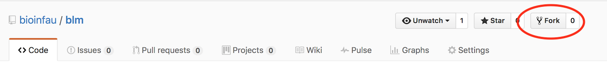
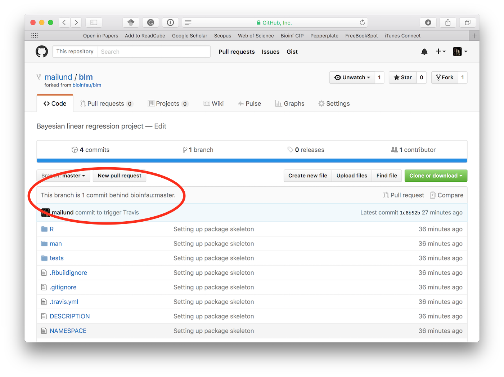
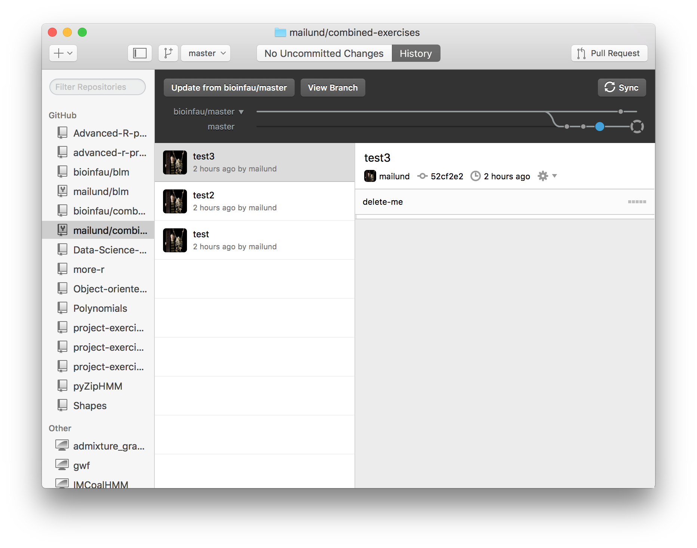
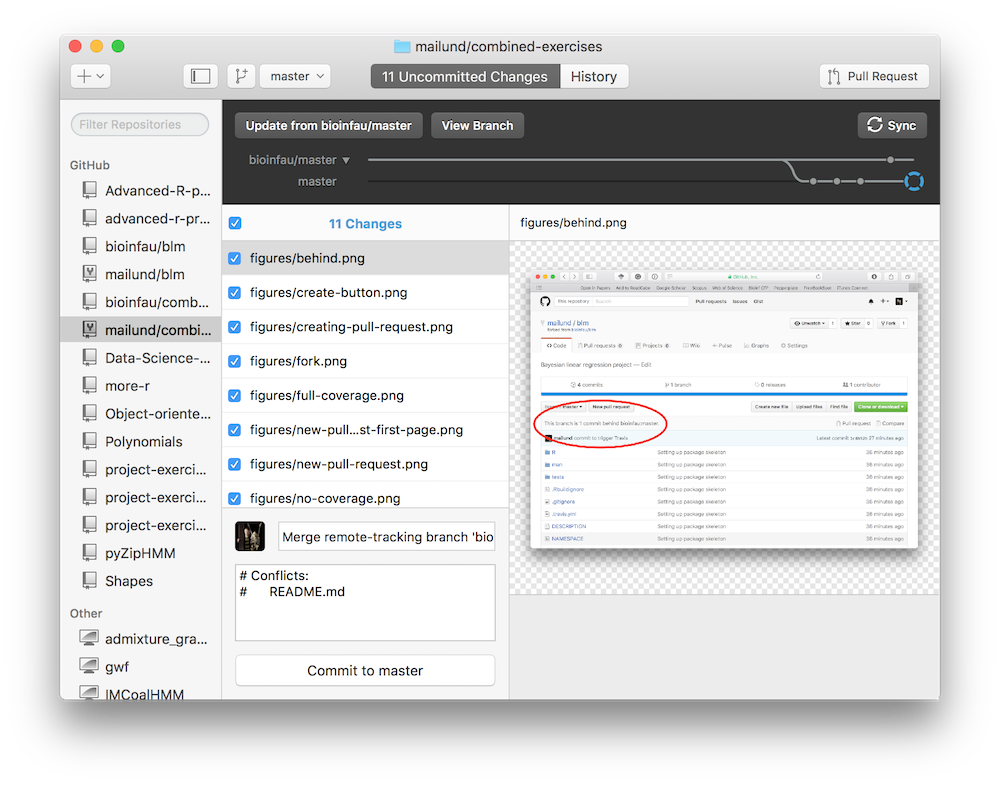
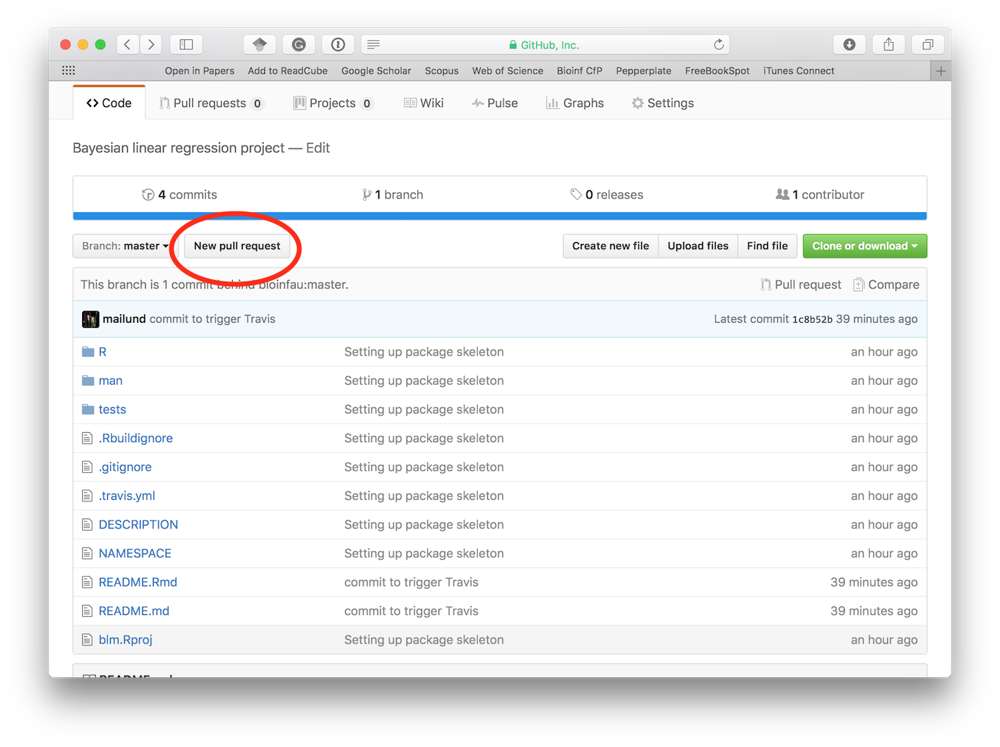
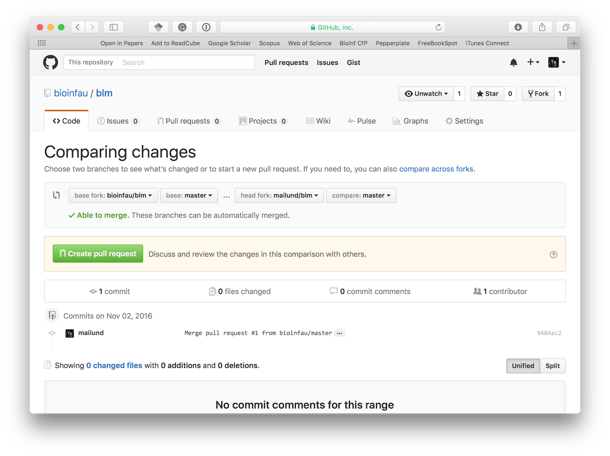
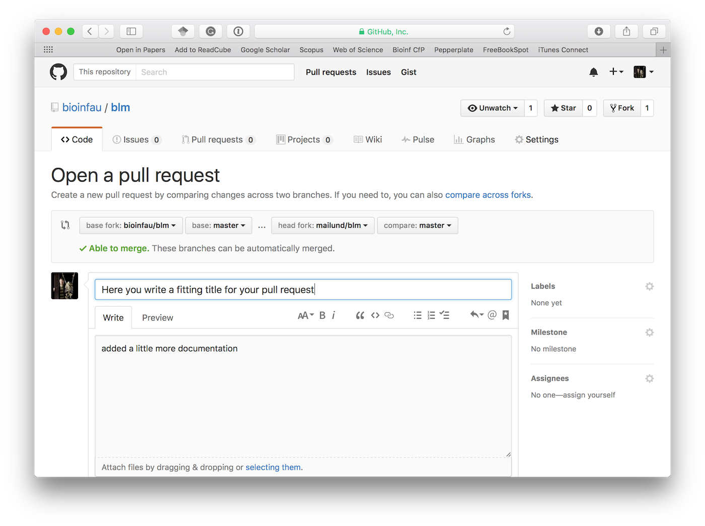
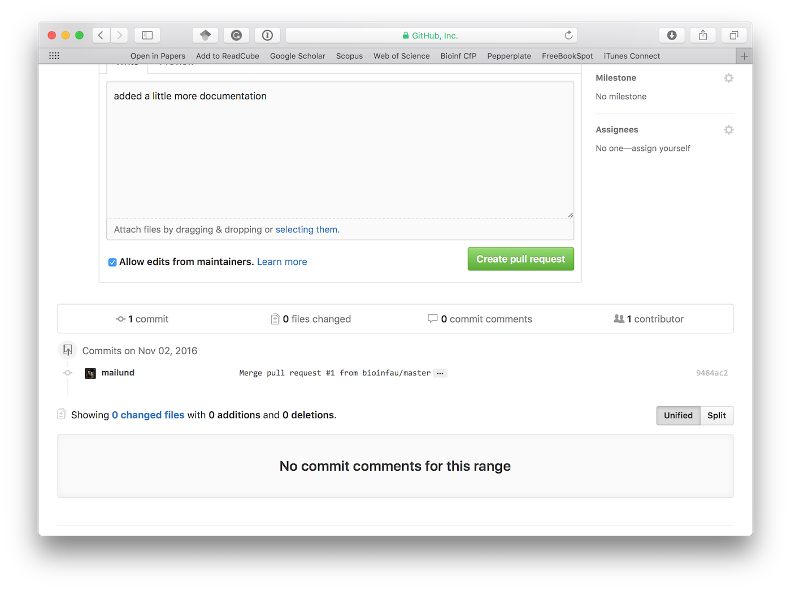
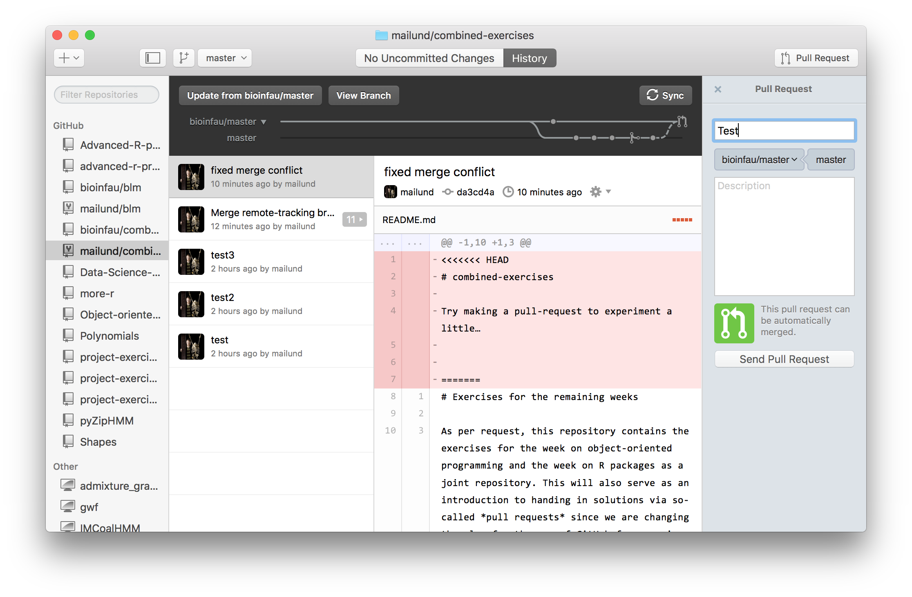

# Exercises for the remaining weeks

As per request, this repository contains the exercises for the week on object-oriented programming and the week on R packages as a joint repository. This will also serve as an introduction to handing in solutions via so-called *pull requests* since we are changing the plan for the use of GitHub for exercises anyway.

## Forking repositories and merging through pull requests

Much collaboration on GitHub works through forking of repositories and pull requests. Forking a repository is essentially the same as making a new clone, you just create a repository on GitHub that is linked to the repository you forked it from, and you then clone the new repository and commit and pull to that. The forked repository is mostly independent from the repository you forked it from, but you can pull changes from it into your own repository and you can send code to it via pull requests: requests to the maintainers of the other repository to pull your code into theirs.

### Forking a repository

Unlike the exercises repositories you have used so far, that are isolated from the template they were based upon, this repository is tied up to an original repository. This one!

With the previous exercises you had your very own repository and there were never any intent to update your version based on mine, or of merging your changes with my code. This is not the typical pattern used when working with source code in a git setting. There the idea is more that we have a network of versions of the code and we can merge code from one version to another.

The typical pattern is that there is a main repository, which in this case would be this repository, and then forks of that. The forks are really just other repositories, but ones you can use to push your changes to. You create a forked repository by clicking on the **fork** button at the top of the repository web page.

This creates a new repository that lives at your own GitHub account. You can clone it down to your own computer just as the repositories you have used before, the only real difference between before and now is that our repositories know about each other and we can use this to communicate changes to the code.

Your repository and mine live separate lives (but know about each other). You can push changes to your own version and they won't be pushed to mine, and changes I make to this repository will not automatically be merged into your repository.

You *can* pull any changes I make to this repository into your own version -- something I don't plan to have happen in this class -- but you cannot push your changes into my version. You don't have write permission to make changes to my code, after all.

If I *do* happen to make changes to this repository it will show up on the page of your repository just above the list of files.

If this happens you can click the **Compare** button and switch branches to make a pull request to yourself that include my changes ... I don't expect it to happen, so that is all I will say about that.

You would also be able to see that the repository you forked from has moved ahead if you use **GitHub Desktop**. There you will get a button that tells you that there is an *Update from bioinfau/master*.

You can click this button to see the difference between your code and the updated original repository

and if you want to, you can merge the changes into your code by clicking **Commit to master**.

### Making pull requests

Since you cannot push your changes into repositories you do not control, the typical pattern is instead to request from a repository maintainer that he or she pulls changes into the main repository from your fork. I won't actually pull your code into this repository in this class, but we will use such pull requests as the way to hand in project exercises.

To make a pull request you push the **New Pull request** button.

This takes you to a page that should look similar to the one shown below:

Here you simply have to press the **Create pull request** button. This will then send you to a page where you can describe the pull request.

In this class you only need to make one such pull request, and I would prefer if the title you give it is your name -- that way I know which pull request was made by each one of you. Normally, when sharing code on GitHub the pull request is used to describe that changes you have made to a repository and explain why you think it is worth merging into the main code base.

Below the field for documentation there is another green button. Press this to actually create the pull request.

Creating the pull request now sends you to a page that looks like this:

Alternatively, you can again use **GitHub Desktop** which has a button in the upper right corner for creating a pull request. If you press this button you will get the option of giving the pull request a name and optionally a description.

If you then push the button **Send Pull Request** you create the pull request and the top right button changes to a number identifying the pull request. Clicking it sends you to the web page for the pull request.

In your case you won't have the option of merging the pull request. I have that, because I can modify both my own repository and this class repository. You will have a similar page, though. It shows the history of what you have done to your code and the comments you have made when creating the pull request. There is also a message about code being checked. I describe that below.

This pull request remains open until either I merge it into this repository -- which I do not plan to do -- or until you or I close it. Whenever you push changes to your repository it will also show up on this pull request, so you now have an automatic way of submitting your handins. You just push changes to GitHub.

(Strictly speaking it is only changes pushed to the branch that was used in the pull request, but since we are not using branches here it won't matter. You can just push your changes and they should show up on the pull request and I will be informed about them).

I will use the pull request to comment on your code -- I can do that both by adding comment to individual code lines or through general comments, and I can even commit my own changes to your pull request -- and you can add comments to the pull request at any time.

If a pull request is closed it doesn’t show up in the list any longer, and if you have synchronised the **GitHub Desktop** will show the **Pull Request** button again, but a pull request is never really gone. You can get all the closed ones back by removing `is:open` from the filters on the page that lists pull requests. (You get to this list by pressing the **Pull requests** in the toolbar, between **Issues** and **Projects**).

When you hand in exercises, I will comment on them. When you have seen the comments I have, please close the pull request so I can see that you have gotten your feedback (and so it doesn’t clutter up the list. If you need to go back to it, for some reason, it is still there and you can re-open it at any time.

## Exercise

Write your name below and make your first pull request!

Hello, my name is ???

